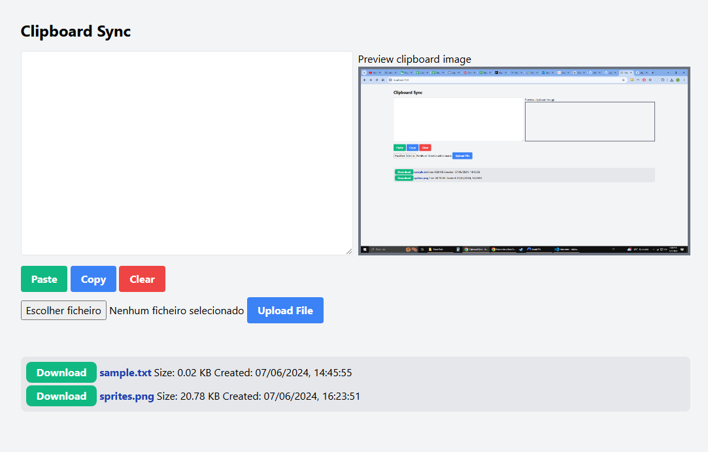
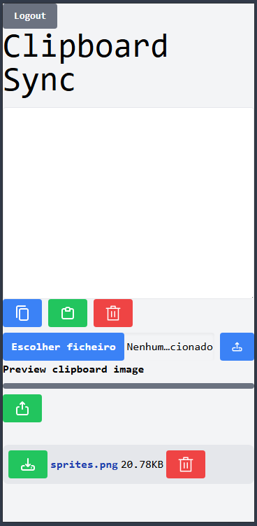
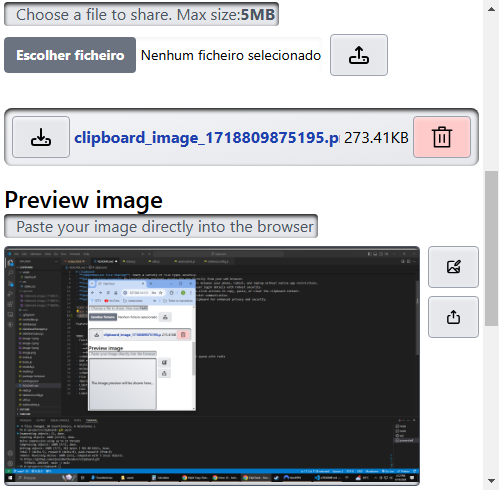
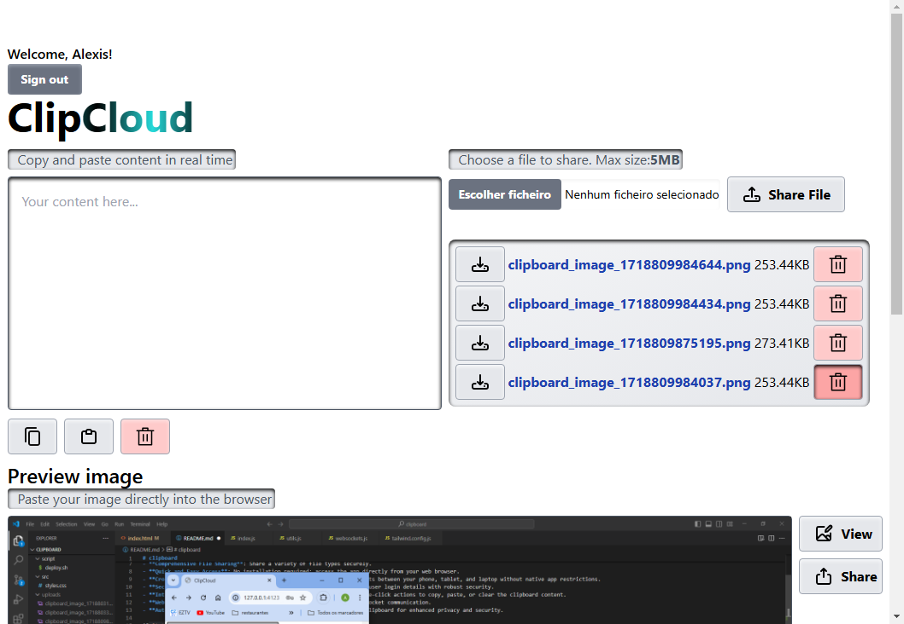

# clipboard
Clipboard project to easily copy/paste text and share files/screenshots between different devices

Key features:
- **Web-Based Clipboard Synchronization**: Instantly copy/paste content across different devices through a browser-based interface.
- **Image and File Preview**: Preview images, such as screenshots or shared photos, directly within the web app before sending.
- **Comprehensive File Sharing**: Share a variety of file types securely.
- **Quick and Easy Access**: No installation required; access the app directly from your web browser.
- **Cross-Device Compatibility**: Effortlessly transfer clipboard contents between your phone, tablet, and laptop without native app restrictions.
- **Secure User Authentication**: Utilizes an SQLite database to manage user login details with robust security.
- **Intuitive User Experience**: Clean and simple interface featuring one-click actions to copy, paste, or clear the clipboard content.
- **WebSocket Technology**: Real-time text sharing implemented with WebSocket communication.
- **Automatic File Cleanup**: Files are automatically deleted from the clipboard for enhanced privacy and security.

Features auto-deployment script with Github webhook.
Deployed using docker image on render https://clipcloud-dz8m.onrender.com

TODO:
- Functionality (websocket or post request) to remove files
  - ~~POST /delete~~ - done
  - ~~Tests for endpoint and error handling~~- done
  - ~~Button to remove files in the client side~~ - done
- ~~Automatically remove files 5 minutes after upload~~ - done using Bull queue with redis
- ~~Add error messages if login or register fail~~
- ~~Styling (better spacing and color theme)~~
- ~~Animated logo~~
- ~~Save userList in database instead of a Map~~ - done using redis
- File encryption
- ~~Improve safety and authentication checks~~
- Limit uploads folder to a set size
- Edit image before uploading
- Limit storage per user to 100MB